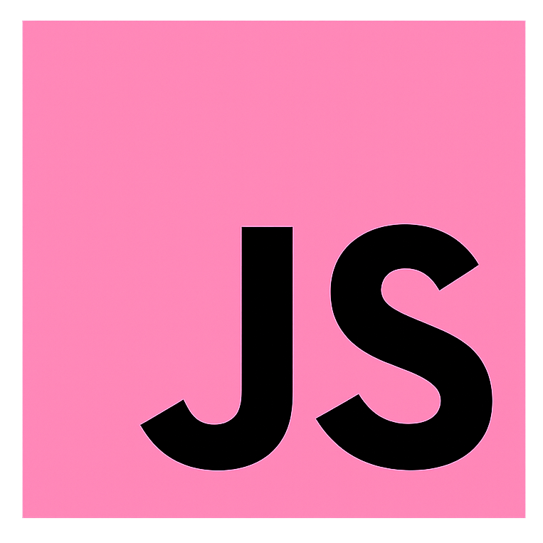
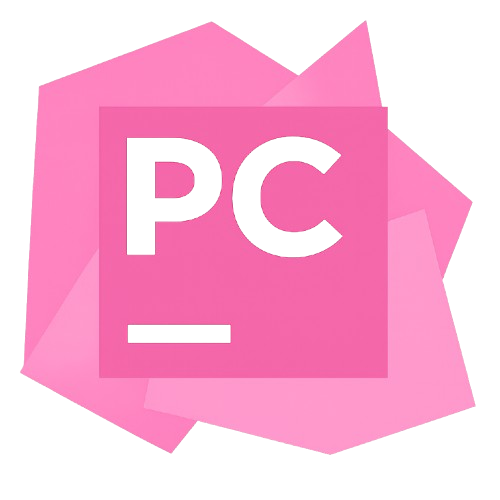

   

    <a href="https://github.com/sthefanyalaminos/sthefanyalaminos/blob/main/README.md">Translate to Portuguese</a>

# Hi! I'm Sthefany Alaminos 💫

Learning in practice how to turn ideas into interfaces! I'm currently developing projects focused on web developmente and data analysis, gradually discovering which area I want to specialize in.
- Systems Analysis and Development student at Mackenzie.
- Interested in programming and technology.
- Frontend Development and Python for data analysis.
- Languages: Portuguese (native) • English (advanced) • Spanish (intermediate)

---
## Tools 🪄
Technologies and tools I use in my programming journey. Each technology represents a step in my learning and in building my skills, with them I study, build projects and grow as a developer.

### Languages & Technologies

### IDEs

---
### Connect with me ✉️
- To access my LinkedIn profile, [click here!](www.linkedin.com/in/sthefany-alaminos)
- To get in touch with me directly, [click here!](mailto:alaminossthefany2@gmail.com)

---